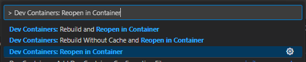

# Solar Insurance DApp Smart Contract

FFHS PiBS, HS 2023/2024, Blockchain, Fabian Diemand  
Dozenten: Malik El Bay, Oliver Dressler  
Repository Smart Contract:  https://github.com/FabianDiemand/solar-insurance-smartcontract  
Repository Frontend: https://github.com/FabianDiemand/solar-insurance-frontend  

---

## Inhalt
* [1 Einleitung](#1-einleitung)
* [2 Frontend](#2-deployment)
* [3 Erklärung Smart Contract](#3-erklärung-smart-contract)
  * [3.1 Konstanten](#31-konstanten-und-formeln)
  * [3.2 Schnittstellen](#32-schnittstellen)
  * [3.3 Bedingungen](#33-bedingungen)
* [4 Technologien und Services](#4-technologien-und-services)
  * [4.1 Solidity](#41-solidity)
  * [4.2 Remix Ethereum IDE](#42-remix-ethereum-ide)
  * [4.3 VS Code und Docker](#43-vs-code-und-docker)
  * [4.4 Hardhat](#44-hardhat)
  * [4.5 Sepolia Testchain](#45-sepolia-testchain)
  * [4.6 Weitere](#46-weitere)
* [5 Deployment](#5-deployment)


---

## 1 Einleitung
Im Rahmen des Moduls Blockchain wurde sich mit Technologien, Anwendungsfällen und rechtlich-wirtschaftlichen Themen rund um die namensgebende Datenstruktur befasst. Teile des Gelernten sollten im Rahmen einer Semesterarbeit mit einer Literatur- oder Engineering-Arbeit angewandt werden.

Im Rahmen diese Semesterarbeit wurde ein Smart Contract geschrieben, der die Policies einer Versicherung für Betreiber einer Photovoltaik-Anlage (fortan PV-Anlage) modelliert. Der versicherte Schaden ist der finanzielle Mehraufwand, durch den Bezug von Strom aus dem Hauptnetz anstelle der eigenen PV-Anlage. Als Indikator für einen Schadenfall wird die Anzahl Sonnenscheinstunden pro Jahr herangezogen.

Die Erkenntnis, dass dieser Indikator nicht alleine relevant für eine Aussage über das Auftreten und das Ausmass eines potenziellen Schadens ist, ist für den Realitätsbezug relevant. Für die Semesterarbeit wird diese Feststellung nicht weiter verarbeitet. Ebenso werden Systemabhängigkeiten von Dritt-APIs zur Datenabfrage und externen Services (namentlich Chainlink) nur im Entwurf erwähnt. Der Fokus liegt auf der Umsetzung des Smart Contracts, dessen Deployment, Verifizierung und der Interaktion mit diesem durch eine grafische Schnittstelle.

## 2 Frontend
Die GUI der Solar Insurance DApp setzt sich aus einer Landing Page ('Insurance') und einer Demo Ansicht ('Demo') zusammen. Die Landing Page bildet die Zugriffsschnittstelle auf die für eine produktive Verwendung notwendigen Funktionen des Smart Contracts. Die Demo Ansicht hilft bei der Verwendung der DApp zu Demo und Test-Zwecken. Sie erlaubt Zustandsänderungen, die üblicherweise durch Interaktionen mit anderen Nutzern oder APIs ('Fund Contract', 'Create Sunshine Record') oder unter stärkeren Einschränkungen ('File Claim') möglich sind.

Weitere Details zum Smart Contract sind in der Dokumentation zum [Frontend](https://github.com/FabianDiemand/solar-insurance-frontend), sowie in der zugehörigen Semesterarbeit dokumentiert.

## 3 Erklärung Smart Contract
Die Solar Insurance DApp setzt sich aus einem Frontend und einem Smart Contract zusammen. Der Smart Contract ist unter der Adresse [0x1c668eafa578dc863e4776407a175341aa5d0965](https://sepolia.etherscan.io/address/0x1c668eafa578dc863e4776407a175341aa5d0965) auf der Seplia Testchain bereitgestellt. Deployment und Code des Contracts, sowie die ABI, Transaktionen und Event Logs können in Etherscan eingesehen werden.

### 3.1 Konstanten und Formeln
Im Kontext dieser Dokumentation werden die Konstanten lediglich aufgelistet. Die Herleitung ist detaillierter in der zugehörigen Semesterarbeit erläutert.

#### Berechnungskonstanten
|Bezeichnung|Wert|
|---|---|
|Energiepreis im Hauptnetz|0.00016 Ether pro kWh|
|Strahlungswert der Sonne|150 W/m<sup>2</sup>|
|Wirkungsgrad von PV Panels|20 %|

#### Risiko-Levels
|Level|Risiko der Versicherung|Sonnenscheinstunden|Prämie pro m<sup>2</sup>|
|---|---|---|---|
|1|Tief|1639|0.00005 Ether|
|2|Mittel|1721|0.00012 Ether|
|3|Hoch|1803|0.00035 Ether|

#### Berechnungsformel für Schadenfälle
$d: \text{Schadensumme in Ether}$<br>
$rad: \text{Strahlungswert}$<br>
$e: \text{Wirkungsgrad}$<br>
$p: \text{Energiepreis in Ether}$<br>
$a: \text{Fläche der Anlage in m}^2$<br>
$sun_{ins}: \text{Anzahl vesicherter Sonnenscheinstunden}$<br>
$sun_{rec}: \text{Anzahl aufgezeichneter Sonnenscheinstunden}$<br>
$\delta sun: \text{Diskrepanz der Sonnenstunden}$<br>

$$ \delta sun = sun_{ins} - sun_{rec}: sun_{ins} > sun_{rec} $$

$$ d = {rad \over 1000} * {e \over 100} * p * a * \delta sun $$

### 3.2 Öffentliche Schnittstelle
#### Hauptfunktionen
Die Hauptfunktionen bilden die öffentliche Schnittstelle, wie sie bei einer tatsächlichen Anwendung mit dem Smart Contract implementiert wären.

|Name   |Parameter   |Beschreibung   |  
|---|---|---|
|registerPolicy|riskLevel, panelArea, location|Schliesst eine Police entsprechend der übergebenen Konfigurations-Parameter ab. Das riskLevel beschreibt dabei, die Höhe des Risikos, welches durch die Versicherung getragen wird. Diese ist korreliert positiv mit der Prämie, welche zum Abschluss anfällt. Gleich verhält es sich mit der panelArea, also der Fläche der PV-Anlage, die versichert wird. Die location der Anlage ist letztlich relevant, um die Betroffenheit durch ausbleibende Sonnenstunden zu bestimmen.
|extendPolicy|-|Verlängert die Policy des Aufrufers um ein Jahr in exakt der bisherigen Konfiguration, sofern eine Police existiert. Existiert bisher keine Police, wird die Transaktion rückgängig gemacht. |
|fileClaim|year|Eröffnet eine Schadenersatz-Forderung und wickelt diese entsprechend der Bedingungen der Police ab. Relevant dabei ist das Jahr, welches als Argument mitgegeben wird und welche Region für den Abschluss der Police angegeben wurde. Diese Faktoren bestimmen, welche Aufzeichnung von Sonnenscheinstunden zur Bewertung herangezogen werden. Massgeblich ist das Kriterium, ob eine Diskrepanz zwischen versicherten und tatsächlichen Sonnenscheinstunden zum Nachteil des Versicherten vorliegt. Der erstattete Betrag berechnet sich aus dem entfallenen Solarstrom-Ertrag in Kilowattstunden, multipliziert mit dem Strompreis des Hauptnetzes.|
|calculatePremium|riskLevel, panelArea|Berechnet die Höhe der Prämie die für eine bestimmte Police anfallen würde. Dafür werden wiederum der riskLevel und die Fläche der zu versicherten Anlage angegeben.|
|getPolicyInformation|-|Gibt die Informationen über die Police des Aufrufers zurück.
|getInsuredRiskByKey|riskLevel|Gibt die Detail-Informationen über die verischerten Sonnenstunden und die Prämie pro einem (1) Quadratmeter Anlagenfläche des als Argument übergebenen riskLevels zurück.
|getInsuredRiskOfPolicy|-|Gibt die Detail-Informationen über die verischerten Sonnenstunden und die Prämie pro einem (1) Quadratmeter Anlagenfläche des riskLevels der Versicherung vom Aufrufer.|
|getRelevantSunshineRecords|-|Gibt die Sonnenscheinstunden, das Jahr und die betroffene Region zurück, welche für die Police des Aufrufers relevant sind. Dabei werden nur die Aufzeichnungen angegeben, für die der Aufrufer noch einen Schadenersatz anfordern darf.|
|createSunshineRecord|year, duration, region|Erzeugt eine Aufzeichnung von Sonnenscheinstunden für ein bestimmtes Jahr in einer bestimmten Region (Süden, Norden). Die Funktion wird im Rahmen der Semesterarbeit vom Nutzer als Demo-Funktion aufgerufen, stünde in einem produktiven Szenario allerding nur dem Orakel zur Verfügung.|

#### Demo-Funktionen
Die Demo-Funktionen bilden den Teil der Schnittstelle zum Smart Contract, welche nur zum Zwecke der Demo/ des Tests für die Semesterarbeit implementiert wurden.
|Name   |Parameter   |Beschreibung   |  
|---|---|---|
|fileClaimWithoutChecks|year|Funktioniert im Kern identisch, wie die produktive Funktion 'fileClaim', lässt aber bis auf die Überprüfung einer existierenden Police und einer existierenden Aufzeichnung, sämtliche weiteren Checks aus.|
|getRelevantSunshineRecordsWithoutChecks|-|Gibt sämtliche Aufzeichnungen von Sonnenscheinstunden, unabhängig derer Relevanz für die abgeschlossene Police zurück. So kann zu Demo-Zwecken flexibel ein Schadenanspruch ausgelöst werden.|
|deletePolicy|-|Löscht eine existierende Police des Aufrufers, falls eine existiert. So können zu Demo-Zwecken verschiedene Policen abgeschlossen werden.|
|fundContract|-|Importiert aus der eigenen 'Fundable' Library. Erlaubt die Finanzierung des Contracts. Durch die fehlende Kundenmenge, muss zu Demo-Zwecken eine initiale Finanzierung stattfinden, welche die Auszahlung von Schadenersatz-Summen erlaubt.|

### 3.3 Bedingungen
Bedingungen werden mit [Modifiern](https://solidity-by-example.org/function-modifier/) realisiert, um das DRY-Prinzip (Don't repeat yourself) einzuhalten und den Code lesbarer zu gestalten.
|Name |Parameter |Beschreibung |
|---|---|---|
|requireOwner|-|Stellt sicher, dass der Aufrufer auch der Besitzer des Smart Contracts ist.|
|requireValidAddress|-|Stellt sicher, dass der Aufrufer nicht eine 0-Adresse ist.|
|requirePremiumCovered|riskLevel, panelArea|Stellt sicher, dass der Wert der Transaktion der geforderten Prämie entspricht|
|requireNotInsured|-|Stellt sicher, dass der Aufrufer **nicht** bereits eine Police abgeschlossen hat.|
|requireInsured|-|Stellt sicher, dass der Aufrufer bereits eine Police abgeschlossen hat.|
|requireRecordExists|year, region|Stellt sicher, dass eine Aufzeichnung von Sonnenstunden für ein bestimmtes Jahr in einer bestimmten Region existiert.|
|requireNonExistingRecord|year, region|Stellt sicher, dass für ein bestimmtes Jahr in einer bestimmten Region noch keine Aufzeichnung von Sonnenstunden eingetragen ist.|
|requireYearClaimable|year|Stellt sicher, dass der Aufrufer für ein bestimmtes Jahr eine Forderung stellen darf.|


## 4 Technologien und Services

### 4.1 Solidity

### 4.2 Remix Ethereum IDE

### 4.3 VS Code und Docker

### 4.4 Hardhat

### 4.5 Sepolia Testchain

### 4.6 Weitere

#### Ethers.js

#### Makefile

## 5 Deployment
### :bangbang: Wichtig :bangbang:
Für die Inbetriebnahme des Frontend ist grundsätzlich kein erneutes Deployment des Smart Contracts notwendig. Soll lediglich die Grundfunktionsweise der DApp getestet werden, kann diese Anleitung ignoriert werden und direkt mit der [Installation des Frontends](https://github.com/FabianDiemand/solar-insurance-frontend/blob/main/.doc/doc.md#5-installation) begonnen werden.

### Anforderungen
- [Docker Desktop](https://www.docker.com/products/docker-desktop/)
- [Visual Studio Code](https://code.visualstudio.com/)
- [Visual Studio Code Dev Containers Extension](https://marketplace.visualstudio.com/items?itemName=ms-vscode-remote.remote-containers)

### Anleitung
1. Clone das Repository <br>
   ```bash
   git clone git@github.com:FabianDiemand/solar-insurance-smartcontract.git
   ```

2. Öffne das geclonte Repository in Visual Studio Code <br>
   ```bash
   code solar-insurance-smartcontract
   ```

3. **EMPFOHLEN:** Öffne das Projekt im entsprechenden Dev Container *(Ctrl + P -> 'Dev Containers: Reopen in Container')* <br>
    <br><br>

   **ALTERNATIV:** Installiere alle Abhängigkeiten lokal
   ```bash
   npm install
   ```

4. Kompiliere den Smart Contract mit Hardhat
   ```bash
   make hardhat-compile
   ```

   Der erwartete Output informiert über den Status der Kompilation:
   > ✔ Help us improve Hardhat with anonymous crash reports & basic usage data? (Y/n) · n <br>
   > Downloading compiler 0.8.22 <br>
   > Compiled 1 Solidity file successfully (evm target: paris). <br>
  
  <br>

5. Setze die gewünschte Ziel-Blockchain als ENV Variable und deploye den Smart Contract mit Hardhat
   ```bash
   export CONTRACT_CHAIN=<target-chain>
   make hardhat-deploy
   ```

   Der erwartete Output sollte die Adresse des Smart Contracts auf der Ziel-Blockchain enthalten:
   > Contract address: 0x1c668eafa578dc863e4776407a175341aa5d0965

   <br>

6. Setze die Adresse des Smart Contract als ENV Variable und verifiziere den Smart Contract mit Hardhat, um den Source Code zu publizieren.
   ```bash
   export CONTRACT_ADDR=<contract-address>
   make hardhat-verify
   ```

   Der erwartete Output informiert über den Status der Verifizierung und generiert einen Link zum veröffentlichten Source Code auf Etherscan
   > Successfully submitted source code for contract <br>
   > contracts/SolarInsurance.sol:SolarInsurance at 0x1c668eafa578dc863e4776407a175341aa5d0965 <br>
   > for verification on the block explorer. Waiting for verification result... <br>
   >
   > Successfully verified contract SolarInsurance on the block explorer. <br>
   > https://sepolia.etherscan.io/address/0x1c668eafa578dc863e4776407a175341aa5d0965#code <br>
  
  <br>

7. Damit das Frontend mit dem richtigen Vertrag interagiert, müssen die Variablen im .env-File des [solar-insurance-frontend](https://github.com/FabianDiemand/solar-insurance-frontend) Projekts entsprechend angepasst werden.

